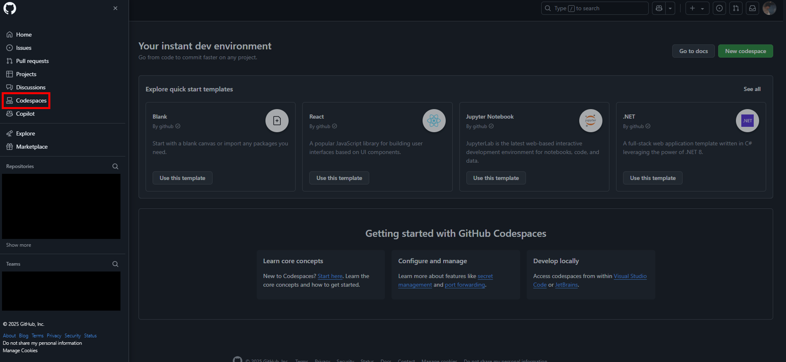
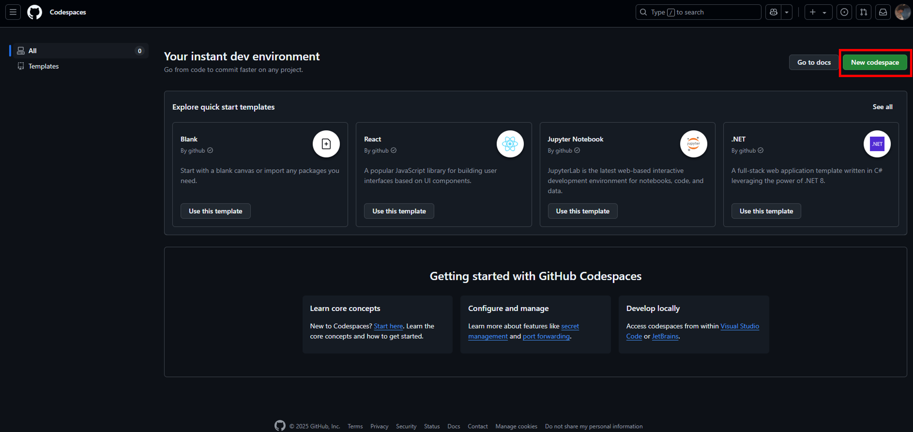

# ハンズオン内容（Azure AKS 版）

## 0. ハンズオン準備

### 0-1. Azureアカウントとサブスクリプションの作成

Azureアカウントを持っている場合は[0-2. テナントとサブスクリプションの確認](#0-2-テナントとサブスクリプションの確認) に進んでください。持っていない場合は、以下のページより無料アカウントとサブスクリプションを作成できます。

参考: [Azure 無料アカウント作成](https://azure.microsoft.com/ja-jp/pricing/purchase-options/azure-account)

無料アカウントとサブスクリプション作成の流れを事前に知りたい場合は、以下の記事を参考にしてください。公式ドキュメントではありませんが、マイクロソフト社員が利用者目線で平易に解説しています。

参考: [無料の範囲で Microsoft Azure を試してみる - Qiita](https://qiita.com/so_nkbys/items/523a11dc4e2828e97506)

### 0-2. テナントとサブスクリプションの確認

[Azure ポータル](https://portal.azure.com/)にログインし、テナントとサブスクリプションのIDをメモしてください。

参考: [Azure ポータルでのサブスクリプション ID とテナント ID の取得](https://learn.microsoft.com/ja-jp/azure/azure-portal/get-subscription-tenant-id)

### 0-3. Codespaceの起動

[GitHub](https://github.com/)の左上のハンバーガーメニュー(三本線)から、`Codespaces`を選択します。




`New codespace`をクリックします。




`Repository`で

TODO: リポジトリ名を確定後に更新
```
k8s-meetup-novice/aks-handson-20250708
```

を選択し、`Create codespace`をクリックします。環境の作成に10分ほどかかります。

### 0-4. Azure CLIのログイン

CodespaceのターミナルでAzure CLIのログインをします。ログイン時、接続するテナントとサブスクリプションを確認されますので、先ほどメモしたIDを選択、入力してください。

```bash
az login
```

### 0-5. 必要な権限の確認

ログインしたユーザーが必要な権限を持っているかを確認します。このハンズオンではサブスクリプションに対し、下記3パターンのうち、いずれかのロール割り当てを前提とします。

- Owner
- Contributor + User Access Administrator
- Contributor + Role Based Access Control Administrator

アカウント作成に合わせてサブスクリプションを作った場合、作成したユーザーにはOwnerが割り当てられます。注意が必要なのは、既存のサブスクリプションを使う場合です。

以下のスクリプトを実行し、確認してください。

```bash
./scripts/check_role_assignments.sh
```

失敗する場合はサブスクリプションの管理者に、いずれかのパターンのロールの割り当てを依頼してください。

## 1. Azureリソースの作成

TerraformでAKSクラスタ、ACR(Azure Container Registry)、ストレージアカウント、仮想ネットワークなど、ハンズオンで使うAzureリソースを作成します。

以下のコマンドを用いて、環境変数を設定します。

```bash
export ARM_SUBSCRIPTION_ID=$(az account show --query id -o tsv)
export RESOURCE_GROUP_NAME=rg-aks-wakaran
export RESOURCE_GROUP_LOCATION=japaneast
export AKS_CLUSTER_NAME=aks-wakaran
export TF_VAR_resource_group_name="${RESOURCE_GROUP_NAME}"
export TF_VAR_resource_group_location="${RESOURCE_GROUP_LOCATION}"
export TF_VAR_aks_cluster_name="${AKS_CLUSTER_NAME}"
```

このハンズオンは環境変数を活用します。Codespacesの停止と再開、ターミナルの作成などを行ったら再度設定してください。

以下のコマンドを実行します。

```bash
cat << EOF
ARM_SUBSCRIPTION_ID:            ${ARM_SUBSCRIPTION_ID}
RESOURCE_GROUP_NAME:            ${RESOURCE_GROUP_NAME}
RESOURCE_GROUP_LOCATION:        ${RESOURCE_GROUP_LOCATION}
AKS_CLUSTER_NAME:               ${AKS_CLUSTER_NAME}
TF_VAR_resource_group_name:     ${TF_VAR_resource_group_name}
TF_VAR_resource_group_location: ${TF_VAR_resource_group_location}
TF_VAR_aks_cluster_name:        ${TF_VAR_aks_cluster_name}
EOF
```

コマンドを実行した結果、以下のように環境変数に各種情報が設定されていることを確認します。

```
ARM_SUBSCRIPTION_ID:            <YOUR-SUBSCRIPTION-ID>
RESOURCE_GROUP_NAME:            rg-aks-wakaran
RESOURCE_GROUP_LOCATION:        japaneast
AKS_CLUSTER_NAME:               aks-wakaran
TF_VAR_resource_group_name:     rg-aks-wakaran
TF_VAR_resource_group_location: japaneast
TF_VAR_aks_cluster_name:        aks-wakaran
```

以下のコマンドで、リソース作成計画が`Plan: 11 to add, 0 to change, 0 to destroy.`と表示されることを確認します。

```bash
cd tffiles
make plan
```

次に、`make apply`コマンドを用いてリソースの作成を実行します。

```bash
make apply
```

以下のように確認が求められるので`yes`と入力します。

```
...
Do you want to perform these actions?
  Terraform will perform the actions described above.
  Only 'yes' will be accepted to approve.

  Enter a value: yes <--- ここでyesと入力してください
```

コマンドが正常に完了すると、以下のように表示されます。10分ほどかかります。

```
Apply complete! Resources: 11 added, 0 changed, 0 destroyed.

Outputs:

acr_name = "akswakaranc8cfea67"
aks_cluster_fqdn = "<YOUR-AKS-API-SERVER>"
aks_cluster_name = "aks-wakaran"
resource_group_name = "rg-aks-wakaran"
storage_account_name = "akswakaranc8cfea67"
```

作成されたACR(Azure Container Refistry)名、ストレージアカウント名などを確認できます。
なお、名前をAzureスコープで一意にする必要があるリソースには、サブスクリプションIDとリソースグループ名で作ったハッシュを名前の接尾辞として加えています。先の例では、`acr_name`の以下太字の部分がそれにあたります。

akswakaran**c8cfea67**


## 2. AKSへのアクセス

AKSにアクセスするため、kubeconfigを取得します。

```bash
az aks get-credentials --resource-group $RESOURCE_GROUP_NAME --name $AKS_CLUSTER_NAME --admin
```

```bash
kubectl cluster-info
```

ノード一覧を確認します。

```bash
kubectl get nodes
```

## 3. アプリケーションのデプロイと外部公開

nginx Podをデプロイします。

```bash
kubectl run nginx --image=nginx -n default
```

Serviceを作成し、クラスタの外部に公開します。`scripts`ディレクトリに格納されている`service.yaml`マニフェストファイルを確認します。

```YAML
apiVersion: v1
kind: Service
metadata:
  name: nginx
  namespace: default
  labels:
    run: nginx
spec:
  ports:
    - port: 80
      protocol: TCP
      targetPort: 80
  selector:
    run: nginx
  type: LoadBalancer
```

このマニフェストを適用すると、KubernetesのServiceが作成され、それに紐付くLoadBalancer(Azure Load Balancer)が設定されます。加えて、パブリックIPが割り当てられます。

```bash
kubectl apply -f ../scripts/service.yaml
```

Serviceの状態を確認します。

```bash
kubectl get svc nginx
```

EXTERNAL-IPが`PENDING`の場合は、パブリックIPを割り当てている途中です。時間をおいて再度確認してください。

```
NAME    TYPE           CLUSTER-IP    EXTERNAL-IP     PORT(S)        AGE
nginx   LoadBalancer   10.0.43.185   <YOUR-IP>       80:30742/TCP   32s
```

nginx Podにアクセスできるか、curlで確認しましょう。

```bash
curl <YOUR-IP>
```

## 4. ACRに格納したコンテナイメージの利用

Docker Hubからnginxイメージをpullし、ACRにpushします。

まずはACR関連情報を環境変数に設定します。

```bash
export ACR_NAME=$(az acr list --resource-group $RESOURCE_GROUP_NAME --query '[0].name' -o tsv) 
export ACR_LOGIN_SERVER=$(az acr show --resource-group $RESOURCE_GROUP_NAME --name $ACR_NAME --query loginServer -o tsv)
```

ACRにログインします。

```bash
az acr login --name $ACR_NAME
```

Docker Hubから、nginxイメージをローカルにpullします。

```bash
docker pull nginx
```

ACR向けに、イメージにタグをつけます。

```bash
docker tag nginx ${ACR_LOGIN_SERVER}/nginx:aks-wakaran
```

ACRにpushします。

```bash
docker push ${ACR_LOGIN_SERVER}/nginx:aks-wakaran
```

では、いまACRにpushしたイメージをAKSで動かしてみましょう。

```bash
kubectl run nginx-from-acr --image ${ACR_LOGIN_SERVER}/nginx:aks-wakaran
```

作成したPodが動いているか確認します。

```bash
kubectl get pods nginx-from-acr
```

以下のように表示されるか、確認してください。

```
NAME             READY   STATUS    RESTARTS   AGE
nginx-from-acr   1/1     Running   0          67s
```

## 5. Workload Identity

AKSには[Workload Identity](https://learn.microsoft.com/ja-jp/azure/aks/workload-identity-overview)と呼ばれるしくみがあり、KubernetesのServiceAccountにAzureのマネージドIDとロールを紐づけることで、PodからAzureのサービスにアクセスできます。


Workload Identityを理解するために、AKSにデプロイしたPodから、Azure CLIを使ってAzureストレージののBlobにアクセスしてみましょう。

> [!NOTE]
> このハンズオンではWorkload Identityを理解するため、順を追ってコマンドで作業します。手数は多いため、理解した後はTerraformなどでコード化をおすすめします

作業ディレクトリを移動します。

```bash
cd ../scripts
```

まずはストレージアカウントにBlobコンテナを作成します。Blobコンテナとは、Blobを入れる論理的な箱です。

Blobコンテナを作るストレージアカウント名を取得します。

```bash
export STORAGE_ACCOUNT_NAME=$(az storage account list --resource-group ${RESOURCE_GROUP_NAME} --query '[0].name' -o tsv)
```

Blobコンテナを作成します。

```bash
az storage container create --account-name $STORAGE_ACCOUNT_NAME --name sample-container --auth-mode login
```

テスト用ファイルをローカルに作ります。

```bash
touch test.txt
```

テスト用ファイルをBlobコンテナにアップロードします。

```bash
az storage blob upload --account-name $STORAGE_ACCOUNT_NAME --container-name  sample-container --file test.txt --name test.txt --auth-mode login
```

念のため、Blobコンテナに入っているファイルを`az storage blob list`コマンドで確認しましょう。

```bash
az storage blob list --account-name $STORAGE_ACCOUNT_NAME --container-name sample-container --auth-mode login -o table
```

以下のように表示されるか確認してください。

```
Name      Blob Type    Blob Tier    Length    Content Type    Last Modified              Snapshot
--------  -----------  -----------  --------  --------------  -------------------------  ----------
test.txt  BlockBlob    Hot                    text/plain      2025-06-03T05:46:05+00:00
```

では、この`az storage blob list`コマンドをPodから実行できるようにしましょう。

まず、現状でそれが可能かを確認します。以下のコマンドでマニフェストを作成します。

```bash
cat << EOF > pod-before.yaml
apiVersion: v1
kind: Pod
metadata:
  name: pod-before
  namespace: default
spec:
  containers:
    - name: azcli
      image: mcr.microsoft.com/azure-cli:azurelinux3.0
      command: ["/bin/sh", "-c"]
      args:
        - |
          az storage blob list --account-name ${STORAGE_ACCOUNT_NAME} --container-name  sample-container --auth-mode login
  restartPolicy: Never
EOF
```

pod-before.yamlというマニフェストファイルが、`scripts`ディレクトリに保存されます。

```YAML
apiVersion: v1
kind: Pod
metadata:
  name: pod-before
  namespace: default
spec:
  containers:
    - name: azcli
      image: mcr.microsoft.com/azure-cli:azurelinux3.0
      command: ["/bin/sh", "-c"]
      args:
        - |
          az storage blob list --account-name <YOUR-STORAGE-ACCOUNT-NAME> --container-name  sample-container --auth-mode login
  restartPolicy: Never
```

このマニフェストを適用します。

```bash
kubectl apply -f pod-before.yaml
```

Podの状態を確認します。

```bash
kubectl get pods pod-before
```

`STATUS`が`Error`となっていることを確認します。

```
NAME         READY   STATUS   RESTARTS   AGE
pod-before   0/1     Error    0          18s
```

以下のコマンドで`Pod`のログを確認します。

```bash
kubectl logs pod-before
```

次のメッセージが表示されるはずです。

```
ERROR: Please run 'az login' to setup account.
```

Azure CLIを未ログインで使ったことがエラーの原因です。そりゃそうだ、ではあるのですが、`az login`コマンドを追加するだけでは解決しません。なぜならPodの実行では、先ほどCodespacesのターミナルで行ったように対話式でログインできないからです。人間が介入することなく、Podに権限を与え、ログインしなければなりません。

そこでWorkload Identityを使います。

AKS作成時にWorkload Identityは使えるように設定してあります。よってこのハンズオンでは、その他に必要なPodやServiceAccount、AzureのマネージドIDやロール関連の作業を行います。

まずはじめに、ユーザー割り当てマネージドIDについて説明します。マネージドIDは、Azureで非人間に対して割り当てられるIDです。たとえば仮想マシンなどのAzureリソースに割り当て可能です。ユーザー割り当てとシステム割り当て、2種類のマネージドIDがありますが、このハンズオンではユーザー割り当てを使います。

参考: [Azure リソースのマネージド ID](https://learn.microsoft.com/ja-jp/entra/identity/managed-identities-azure-resources/overview)

以降の作業を理解の上進められるよう、流れをまとめておきます。

- ユーザー割り当てマネージドIDを作る
- ユーザー割り当てマネージドIDにBlobを閲覧できるロールを割り当てる
- KubernetesのServiceAccountを作る
- フェデレーションID資格情報を作り、ユーザー割り当てマネージドIDとServiceAccountを紐づける
- 先ほど実行に失敗したPodの定義に以下を追加し、実行する
  - Workload Identity有効化
  - ServiceAccount指定
  - Azure CLIログイン処理

それでは、ユーザー割り当てマネージドIDを作りましょう。

```bash
export USER_ASSIGNED_IDENTITY_NAME="id-aks-wakaran"
az identity create \
    --name "${USER_ASSIGNED_IDENTITY_NAME}" \
    --resource-group "${RESOURCE_GROUP_NAME}" \
    --location "${RESOURCE_GROUP_LOCATION}" \
    --subscription "${ARM_SUBSCRIPTION_ID}"
```

次に、ユーザー割り当てマネージドIDにストレージBlob閲覧者ロールを割り当てます。

まずはユーザー割り当てマネージドIDのプリンシパルIDを取得します。プリンシパルIDとは、AzureがID管理サービスとして使っているEntra IDテナント内で、オブジェクトを識別するための値です。ロールを割り当てはプリンシパルIDに対して行うため、取得しておきます。

```bash
export IDENTITY_PRINCIPAL_ID=$(az identity show \
    --name "${USER_ASSIGNED_IDENTITY_NAME}" \
    --resource-group "${RESOURCE_GROUP_NAME}" \
    --query principalId \
    --output tsv)
```

ロール割り当てのスコープであるストレージアカウントのリソースIDを取得します。

```bash
export STORAGE_ACCOUNT_RESOURCE_ID=$( az storage account show --resource-group $RESOURCE_GROUP_NAME --name $STORAGE_ACCOUNT_NAME --query id -o tsv)
```

ユーザー割り当てマネージドIDに、Blobデータ閲覧者ロールを割り当てます。

```bash
az role assignment create \
    --assignee-object-id "${IDENTITY_PRINCIPAL_ID}" \
    --role "Storage Blob Data Reader" \
    --scope "${STORAGE_ACCOUNT_RESOURCE_ID}" \
    --assignee-principal-type ServicePrincipal
```

次に、ユーザー割り当てマネージドIDのクライアントIDを取得します。クライアントIDとは、OIDC/OAuthの文脈でサービスやアプリケーションを識別するための値、と考えてください。クライアントIDでEntra ID認証し、トークンを得ます。クライアントIDは先ほどのプリンシパルIDと違い、Entra IDのテナントにとどまらない、Entra ID全体で一意な値です。

```bash
export USER_ASSIGNED_CLIENT_ID="$(az identity show \
    --resource-group "${RESOURCE_GROUP_NAME}" \
    --name "${USER_ASSIGNED_IDENTITY_NAME}" \
    --query 'clientId' \
    --output tsv)"
```

Kubernetesでの作業に移ります。ServiceAccountに必要な情報を環境変数に設定します。

```bash
export SERVICE_ACCOUNT_NAMESPACE="default"
export SERVICE_ACCOUNT_NAME="workload-identity-sa-aks-wakaran"
```

ServiceAccountのマニフェストを作ります。

```bash
cat << EOF > serviceaccount.yaml
apiVersion: v1
kind: ServiceAccount
metadata:
  annotations:
    azure.workload.identity/client-id: "${USER_ASSIGNED_CLIENT_ID}"
  name: "${SERVICE_ACCOUNT_NAME}"
  namespace: "${SERVICE_ACCOUNT_NAMESPACE}"
EOF
```

マニフェストを適用します。

```bash
kubectl apply -f serviceaccount.yaml
```

次に、フェデレーションID資格情報を作ります。フェデレーションID資格情報で、ユーザー割り当てマネージドIDとServiceAccountが紐づきます。

フェデレーションID資格情報の作成に必要な、OIDC Issuer URLを取得します。

```bash
export AKS_OIDC_ISSUER="$(az aks show --name "${AKS_CLUSTER_NAME}" \
    --resource-group "${RESOURCE_GROUP_NAME}" \
    --query "oidcIssuerProfile.issuerUrl" \
    --output tsv)"
```

フェデレーションID資格情報を作ります。

```bash
export FEDERATED_IDENTITY_CREDENTIAL_NAME="fidc-aks-wakaran"
az identity federated-credential create \
    --name ${FEDERATED_IDENTITY_CREDENTIAL_NAME} \
    --identity-name "${USER_ASSIGNED_IDENTITY_NAME}" \
    --resource-group "${RESOURCE_GROUP_NAME}" \
    --issuer "${AKS_OIDC_ISSUER}" \
    --subject system:serviceaccount:"${SERVICE_ACCOUNT_NAMESPACE}":"${SERVICE_ACCOUNT_NAME}" \
    --audience api://AzureADTokenExchange
```

準備は整いました。以下のコマンドでWorkload Identityを使ったPodのマニフェストを作成します。

```bash
cat << EOF > pod-after.yaml
apiVersion: v1
kind: Pod
metadata:
  name: pod-after
  namespace: default
  labels:
    azure.workload.identity/use: "true"
spec:
  serviceAccountName: ${SERVICE_ACCOUNT_NAME}
  containers:
    - name: azcli
      image: mcr.microsoft.com/azure-cli:azurelinux3.0
      command: ["/bin/sh", "-c"]
      args:
        - |
          az login --service-principal --username \$AZURE_CLIENT_ID --tenant \$AZURE_TENANT_ID --federated-token \$(cat \$AZURE_FEDERATED_TOKEN_FILE) &&
          az storage blob list --account-name ${STORAGE_ACCOUNT_NAME} --container-name  sample-container --auth-mode login -o table
  restartPolicy: Never
EOF
```

`pod-after.yaml`というマニフェストファイルが、`scripts`ディレクトリに保存されます。

```yaml
apiVersion: v1
kind: Pod
metadata:
  name: pod-after
  namespace: default
  labels:
    azure.workload.identity/use: "true"
spec:
  serviceAccountName: workload-identity-sa-aks-wakaran
  containers:
    - name: azcli
      image: mcr.microsoft.com/azure-cli:azurelinux3.0
      command: ["/bin/sh", "-c"]
      args:
        - |
          az login --service-principal --username $AZURE_CLIENT_ID --tenant $AZURE_TENANT_ID --federated-token $(cat $AZURE_FEDERATED_TOKEN_FILE) &&
          az storage blob list --account-name akswakaranc8cfea67 --container-name  sample-container --auth-mode login -o table
  restartPolicy: Never
```

`az login`コマンドの引数の一部が展開されていませんが、意図通りです。これらはPodの作成時に展開されます。

このマニフェストを適用します。

```bash
kubectl apply -f pod-after.yaml
```

Podの状態を確認しましょう。

```bash
kubectl get pods pod-after
```

`STATUS`が`Completed`となっていることを確認します。

```
NAME        READY   STATUS      RESTARTS   AGE
pod-after   0/1     Completed   0          2m36s
```

ログを出力します。

```bash
kubectl logs pod-after
```

Blobコンテナを参照できたことを確認します。

```
Name      Blob Type    Blob Tier    Length    Content Type    Last Modified              Snapshot
--------  -----------  -----------  --------  --------------  -------------------------  ----------
test.txt  BlockBlob    Hot                    text/plain      2025-06-03T05:46:05+00:00
...

## 6. クリーンアップ

```bash
cd tffiles
make destroy
```

`yes`を忘れずに。

なお、このハンズオンで作成したAzureリソースにはタグ`Project=aks-wakaran`をつけてあります。以下のコマンドで、削除できたか確認してください。

```bash
az resource list --tag Project=aks-wakaran
```

> [!NOTE]
> `make destroy`が失敗してしまったり、Codespaceを消してしまったり、などの理由で強制的にハンズオンリソースを削除したい場合は、Azureポータルでリソースグループを消してください。
>
> [リソース グループとリソースを削除する](https://learn.microsoft.com/ja-jp/azure/azure-resource-manager/management/delete-resource-group?tabs=azure-powershell#delete-resource-group)
